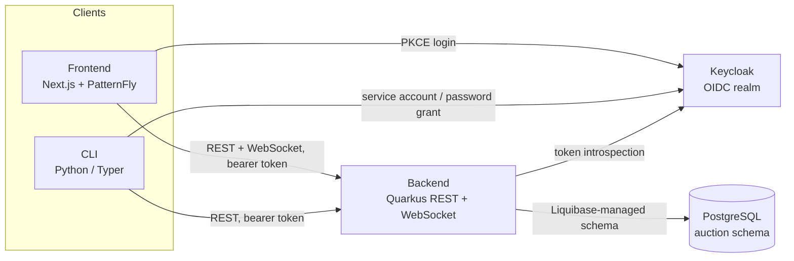

# Architecture

## System Diagram

The frontend and CLI are both thin clients of the backend's REST API — neither talks to the database directly, and neither implements auction/bidding logic itself. The backend is the single source of truth for domain state and the only component with a database connection.

## Components

### Backend — `silent-auction-backend`

Quarkus 3 / Java 17. Exposes `api/v1/auctions`, `api/v1/bids`, and `api/v1/users` (see [Auctions](auctions.md), [Bids](bids.md), [Users](users.md)), plus a WebSocket channel that pushes auction and highest-bid updates on a schedule. PostgreSQL persistence via Hibernate ORM, schema managed by Liquibase. Authorization is enforced with `@Authenticated`/`@RolesAllowed`, backed by Keycloak's policy enforcer in production.

Internally the codebase follows a hexagonal (ports/adapters) layout: JAX-RS `controllers/` handle HTTP/WS only, `repositories/` own persistence, and `ports/`/`adapters/` form the boundary between them.

### Frontend — `silent-auction-frontend`

Next.js 15 (App Router) with PatternFly 6, the Red Hat design system. Renders the auction list, an individual auction's bid history and bid-placement flow, a cross-auction highest-bids leaderboard, and an admin-only user management screen. State is organised as nested React context providers — `ConfigProvider → AuthProvider → UsersProvider → AuctionsProvider` — each exposing a hook (`useConfig`, `useAuth`, `useUsers`, `useAuctions`).

Runtime configuration (`BACKEND_URL`, Keycloak settings, `BID_INCREMENT`, etc.) is served by a Next.js API route rather than baked in at build time, so the same container image is deployable to any environment — see [ADR-0002](0002-runtime-environment-configuration-for-frontend.md).

### CLI — `silent-auction-cli`

A Python/Typer client (`typer_shell`) offering the same auction/bid/user operations as the frontend, aimed at scripting and demos from a terminal. It mirrors the backend's layered structure (`controllers/` → `repositories/`/entities, plus `adapters/` for Keycloak and scheduling), and authenticates against the same Keycloak realm as the frontend.

### Demo infra — `silent-auction-demo-infra`

A GitOps repo that stands the whole stack up on OpenShift (ROSA, ARO, or bare metal) via ArgoCD, structured as a layered app-of-apps:

1. **`1-bootstrap`** — Ansible playbook that installs ArgoCD/OpenShift GitOps onto a fresh cluster
2. **`2-environments`** — per-environment ArgoCD `Application` manifests (currently `rosa`) pointing at the layers below
3. **`3-operators`** — Kustomize bases/overlays for the operators the stack depends on: Crunchy Data (PostgreSQL), OpenShift Pipelines (Tekton), OpenShift Dev Spaces, and secrets management
4. **`4-workloads`** — the actual application workloads per environment (`devspaces`, `production`): Crunchy PostgreSQL instance, DB init, pgAdmin, routes, config/secrets, and Argo Rollouts definitions

See [ADR-0003](0003-layered-gitops-deployment-via-argocd-app-of-apps.md) for the reasoning behind this layering.

## Authentication

A single Keycloak realm is shared across the frontend, backend, and CLI. The frontend authenticates end users via the OIDC PKCE flow; the CLI authenticates via a Keycloak service account or direct grant; the backend never issues tokens itself — it validates bearer tokens against Keycloak and enforces role-based access (`admin` vs. bidder) from realm/group membership. See [ADR-0001](0001-keycloak-oidc-for-cross-component-auth.md).

## CI/CD

Each application repo (`backend`, `frontend`) builds via its own Tekton pipeline (`.tekton/pipelinerun.yaml`): clone → build → container image → push to Quay. Deployment to OpenShift is driven from `silent-auction-demo-infra` via ArgoCD, which reconciles the cluster against the layers described above.